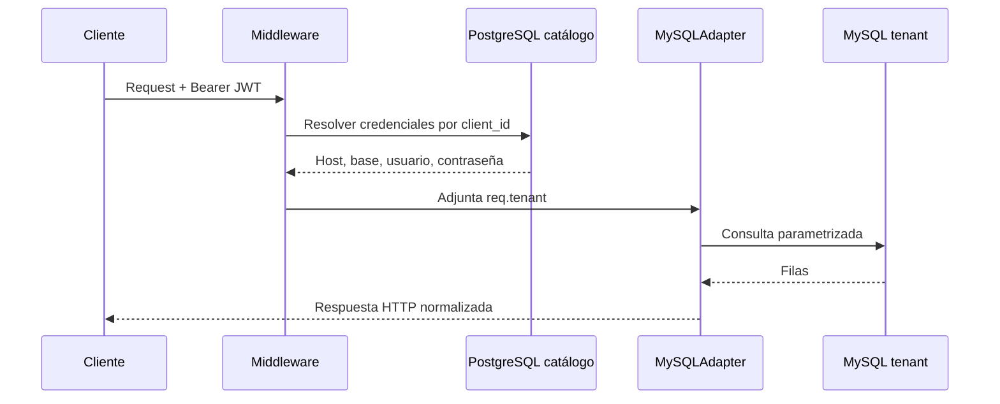

# Arquitectura

## Propósito y tecnologías

`web-reports-api` ofrece informes operativos desde las bases MySQL de clientes, usando PostgreSQL como catálogo de usuarios y configuración de tenants. El servidor HTTP se implementa con NestJS 11, TypeScript, Express, TypeORM (`pg`) y `mysql2/promise`. JWT y Passport participan en la autenticación; `class-validator` y `class-transformer` validan los DTO. Swagger genera el contrato navegable.

## Estructura del repositorio

```text
src/
  main.ts                         bootstrap HTTP, CORS, Swagger y validación global
  app.module.ts                   módulos globales, middleware y cache
  admin/                          resolución de conexión por client_id
  login/                          autenticación, JWT, estrategia y guards
  reports/                        endpoints, SQL, casos de uso, validadores y DTO
  warehouses/                     consulta de almacenes
  database/                       abstracción DB y adaptadores PostgreSQL/MySQL
  postgres-entities/              entidades del catálogo en PostgreSQL
  local-responses/                clases y tipos de respuesta/paginación
  middlewares/                    autenticación y asociación del tenant a la request
  commons/                        interceptor de logging
  common/                         utilidades de fechas
  types/                          tipos compartidos de request/tenant
```

Los módulos Nest están en `login`, `reports`, `warehouses` y `admin`. Los controladores traducen HTTP a llamadas a compositores; los compositores construyen el adaptador, servicio y caso de uso. En reportes y almacenes, el caso de uso transforma el resultado SQL al formato de respuesta. `ReportsService` contiene las consultas de informes.

## Petición autenticada: flujo de tenant

1. `POST /login/auth` consulta `conxpos_utilities_auth` en PostgreSQL por `username`; compara la contraseña con bcrypt y firma un JWT con `username` y `client_id` dentro de `tokenObject`.
2. `ValidationMiddleware`, aplicado a todas las rutas salvo el login, exige un encabezado Authorization. Verifica el JWT y toma el `client_id`.
3. `TenantDatabaseService` busca en PostgreSQL los registros activos de autenticación y base de datos, y cachea la configuración bajo `tenant_<clientId>`.
4. El middleware adjunta `req.user.id` y `req.tenant` (host, database, user y password).
5. `MySQLAdapter` obtiene un pool de `MySQLConnectionFactory` para ese tenant; cada servicio toma y libera una conexión.
6. Servicio, caso de uso y controlador devuelven el resultado al cliente.



## Capa de datos

- **PostgreSQL:** `postgresDatasource()` construye un DataSource TypeORM con las entidades `Client`, `ConxposUtilityAuth` y `ConxposUtilityDataBase`. La fuente se inicializa en las llamadas que la necesitan. Login destruye el DataSource al finalizar su operación. La resolución de tenant consulta dos repositorios.
- **MySQL:** `MySQLAdapter` implementa `DatabaseConnection` con `getConnection`, `query`, `execute` y `release`. Los servicios usan SQL parametrizado y suelen liberar la conexión en `finally`.
- `MySQLConnectionFactory` conserva pools estáticos por clave `host_database_user`. El puerto y límite de conexiones provienen de `database.config.ts`.
- El módulo de cache-manager registra caché global con `ttl: 3600 * 1000` y `max: 500`; `TenantDatabaseService` no pasa TTL al `set`.

## Modelo de métodos

### Controlador

Responsable de declarar rutas, recibir parámetros/DTO, invocar validadores cuando corresponde, llamar al compositor/caso de uso y aplicar el código HTTP.

### Validador

`SalesDayValidator`, `InvoiceDetailValidator` y `CashCountsValidator` realizan comprobaciones de dominio previas a ciertas consultas. Devuelven `ValidationResponse(success, data)` con mensaje y estado lógico.

### Compositor

Las funciones `*UseCaseCompositor(req)` arman explícitamente el grafo `MySQLAdapter → Service → UseCase`; `validator.compositor.ts` arma adaptadores para validadores. El login crea `LoginService` sin tenant.

### Caso de uso

`main(...)` orquesta una operación de negocio, interpreta el retorno del servicio, decide estado lógico éxito/error y, si aplica, adapta nombres/tipos y paginación. Cada caso conoce una operación y delega SQL al servicio.

### Servicio

`ReportsService` y `WarehousesService` manejan conexión, SQL y forma cruda (`{data, error}`). `LoginService` lee el usuario en PostgreSQL.

## Respuestas

`HttpResponse` serializa `{ response, status, message, name }` (mensaje por defecto `Http Response`, nombre por defecto `HttpResponse`). `UseCaseResponse` produce `{ status, data }`; cuando recibe `limit`, convierte `{list, count, summary?}` a `{list, count, totalPages, summary?}`. Los errores de validación y autenticación tienen cuerpos propios.

Los estados lógicos que asignan casos de uso son normalmente `1` para éxito y `0` para error. Las funciones `getHttpStatus*` asignan códigos HTTP; el mapeo concreto depende de cada módulo.

## Validación, Swagger y middleware

`main.ts` activa CORS con origen reflejado y credenciales, instala `LoggingInterceptor`, configura timeout de servidor de 1.500.000 ms, monta Swagger en `/api/v1/docs`, y registra `ValidationPipe` global con `whitelist`, `forbidNonWhitelisted` y `transform`. `AppModule` excluye `POST login/auth` del middleware de tenant; todas las demás rutas pasan por él.

## Observaciones para mantenimiento

- El middleware JWT llama a `verify(..., {ignoreExpiration: true})`, por lo que no aplica la expiración estándar; `JwtStrategy`, aunque existe, sí fija `ignoreExpiration: false`, pero las rutas actuales usan middleware global, no un `JwtAuthGuard` declarado en el controlador.
- `LoginUseCase` define `exp` usando `date.getTime()` (milisegundos desde epoch); JWT interpreta `exp` como segundos. Debe revisarse esta unidad junto con la verificación que ignora expiración.
- `DashboardDto` declara fechas opcionales pero el controlador las recibe sin pasarlas al caso de uso: el dashboard calcula internamente el día actual y la ventana de siete días.
- `DB_*` describe valores por defecto del pool MySQL; la conexión de cada request usa credenciales de tenant. `POSTGRES_*` es configuración necesaria para el catálogo.
- `SOLUTION_SUMMARY.md` documenta correcciones de consistencia de ventas existentes; sirve como antecedente de negocio, no como especificación completa de cada consulta.
